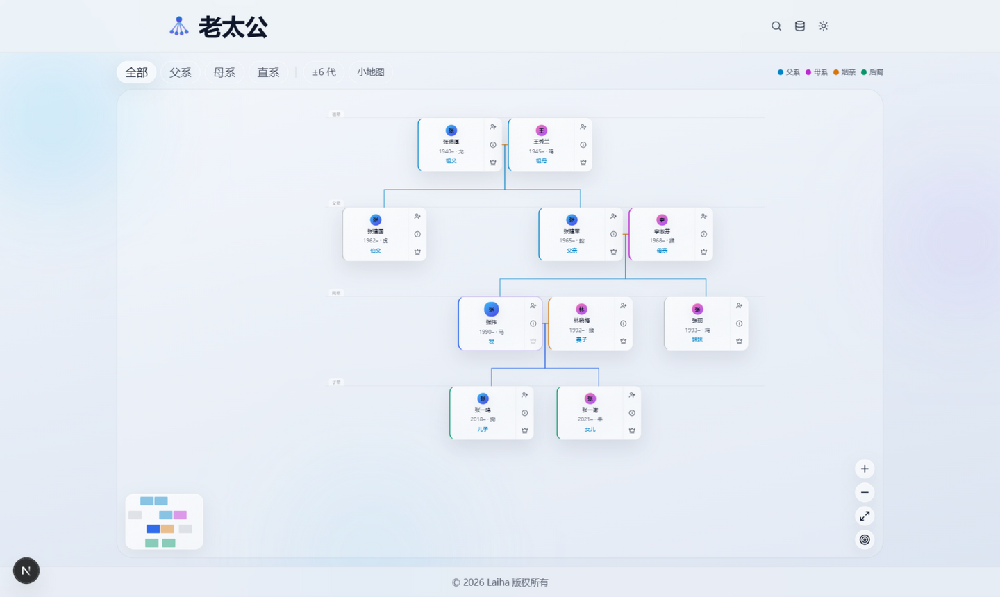
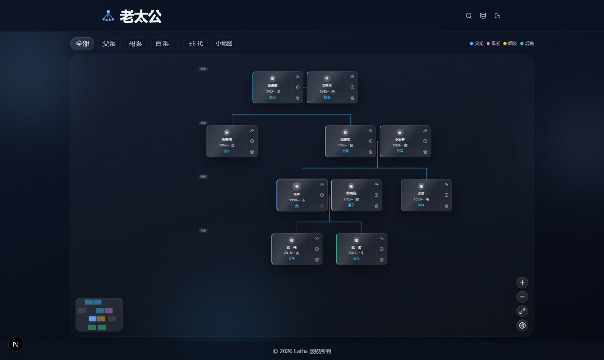
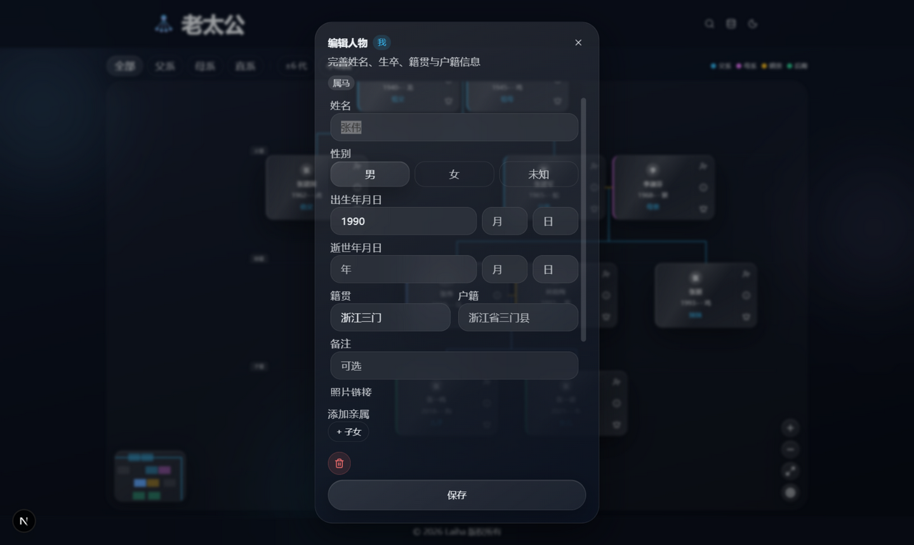

<div align="center">


# 老太公 · 家族图谱

**以「我」为原点的家族关系图谱 —— 液态玻璃视觉 · 纯本地运行 · 零后端**

[](https://github.com/laihaibo/laotagong/actions/workflows/deploy.yml)


[](#-参与贡献)

*一个为中文家族设计的族谱应用：向上追祖、向下延孙、横向连姻，*
*五服、生肖、享年、亲属称谓全部由关系数据实时推导，不落库、不需要迁移。*

<br>

<picture>
  <source media="(prefers-color-scheme: dark)" srcset="docs/screenshots/tree-dark.png">
  
</picture>

</div>

---

## ✨ 特性

### 🌳 家族树画布

- **主界面即画布**：滚轮 / 双指缩放（以指针为锚点）、拖拽平移、小地图导航，一键「看全族」「回到我」
- **经典族谱连线**：夫妻横线相连，从横线中点垂落总线，分叉到每个子女的顶边中点
- **代际横带**：祖辈 / 父辈 / 同辈 / 子辈 / 孙辈一目了然
- **亲系着色与筛选**：父系、母系、直系、后裔按色彩区分，可一键过滤，还能限制展示代数

### 🧮 推导引擎（一切可算的都不落库）

| 信息 | 推导方式 |
|---|---|
| 世代与关系距离 | 以「我」为原点 BFS，切换「我」全图自动重算 |
| **五服**服制 | 本宗九族经典算法：斩衰 / 齐衰 / 大功 / 小功 / 缌麻 / 出服，**并给出推导依据** |
| 亲属称谓 | 由关系路径实时推算 |
| 生肖 | `(生年 − 4) mod 12`，「约1950」这类写法也能推，并标注「（推）」 |
| 享年 | 卒年 − 生年，缺一端或卒早于生则不猜 |

### 👤 人物档案

- 籍贯、户籍、生卒年月日（容忍「约1950」「?」等不规范写法）、备注
- **照片头像**：填外链即可，不上传、不占本地存储配额
- **家族事件**：婚嫁、迁徙、出生、离世、褒学等，含时间、地点、备注
- 卡片一键添加父母 / 子女 / 配偶，也可关联已有成员；自动回填缺失的另一位亲长，有歧义时逐条请你确认，**绝不凭空捏造祖先**

### 🔍 查找与隐私

- 按姓名 / 籍贯 / 户籍搜索，配合性别与在世筛选；结果按「以我为原点」的关系距离分组
- **隐私优先**：全部数据只存在你自己的浏览器 localStorage，没有账号、没有服务器、没有埋点
- **数据归你**：随时导出 / 导入 JSON；`pnpm build` 产物为纯静态文件，可以托管在任何地方——包括你自己的内网

## 📸 更多截图

| 深色主题 | 人物档案 |
|---|---|
|  |  |

## 🚀 快速上手

```bash
git clone https://github.com/laihaibo/laotagong.git
cd laotagong
pnpm install
pnpm dev        # http://localhost:3000
```

要求 Node ≥ 22、pnpm。

```bash
pnpm build      # 静态导出到 out/，可直接托管
pnpm test       # vitest + jsdom，131 个测试
pnpm test:watch
```

## 📐 数据模型

刻意地小。5 个键，没有 `generation` 字段——世代是运行时推导的（见上表），
不需要数据迁移，也不可能跟源数据不一致。

```ts
interface FamilyState {
  version: 1;
  persons: Record<string, Person>;
  parents: Record<string, { fatherId?: string; motherId?: string }>;  // childId → 双亲
  spouses: Array<{ a: string; b: string }>;                            // 无序对
  meId: string | null;
}
```

`Person` 支持籍贯 / 户籍 / 生卒（字符串，容忍「约1950」）/ 照片外链 / 生平事件。

> 婚姻与共同养育是**两种独立的边**：先加父亲、再加母亲不会伪造出一段婚姻。
> 族谱里凭空捏造关系，比留一个空缺更糟。

## 🏗️ 项目结构

```
app/                  Next.js App Router（output: "export"，无服务端能力）
  globals.css         设计 token + 玻璃样式（唯一设计来源）
components/
  family-tree.tsx     画布：缩放 / 平移 / 小地图 / 代际横带 / 连线渲染
  family-app.tsx      应用外壳与各弹窗
lib/
  family.ts           纯函数数据层：关系写入、对称回填、关系距离、五服、生肖
  tree.ts             布局与连线几何（纯函数，逐点采样测试守卫）
  lineage.ts          亲系分类 / 筛选 / 族谱排序
  kinship.ts          亲属称谓推导
test/                 vitest + jsdom：数据不变量、布局几何、指针交互、模糊测试
```

架构约束、数据不变量与历史踩坑详见 [`CLAUDE.md`](./CLAUDE.md)——
动数据层或设计 token 之前请先读它。

## 🧪 测试

```bash
pnpm test
```

131 个测试覆盖数据层的核心不变量：关系**双写对称**、回填只在无歧义时发生、
关系距离推导、序列化往返、非法输入不抛错；布局层面有「任意两卡片不得相交」
与「连线逐点采样不得穿过卡片」的几何守卫；画布指针交互（拖拽中抬手、双指缩放）
也有回归测试。

## 📦 部署到 GitHub Pages

1. 推送到 `main` / `master` 分支
2. 仓库 Settings → Pages → Source 选择 **GitHub Actions**
3. 自动构建发布（Node 22 + pnpm）；`verify` job 先跑全部测试，**测试红了就挡住部署**

用户站点与项目站点均自动适配 basePath。

## 🗺️ 路线图

- [ ] 多配偶关系的选择器（当前多配偶可录入，连线按最近邻绘制）
- [ ] 人物卡片头像上传（当前为外链）
- [ ] PWA 离线使用
- [ ] 导出为图片 / 可打印的族谱排版

> 有想法？欢迎开 issue 讨论。

## 🤝 参与贡献

欢迎 Issue 与 PR。提交前请：

1. `pnpm test` 全绿
2. 涉及数据层或设计 token 时，先读 [`CLAUDE.md`](./CLAUDE.md) 里的不变量
3. 为新行为补上对应的回归测试

## 📄 许可

Copyright © 2026 Laiha。保留所有权利。

---

<div align="center">

**老太公** —— 记住来处，才知道去处。

</div>
